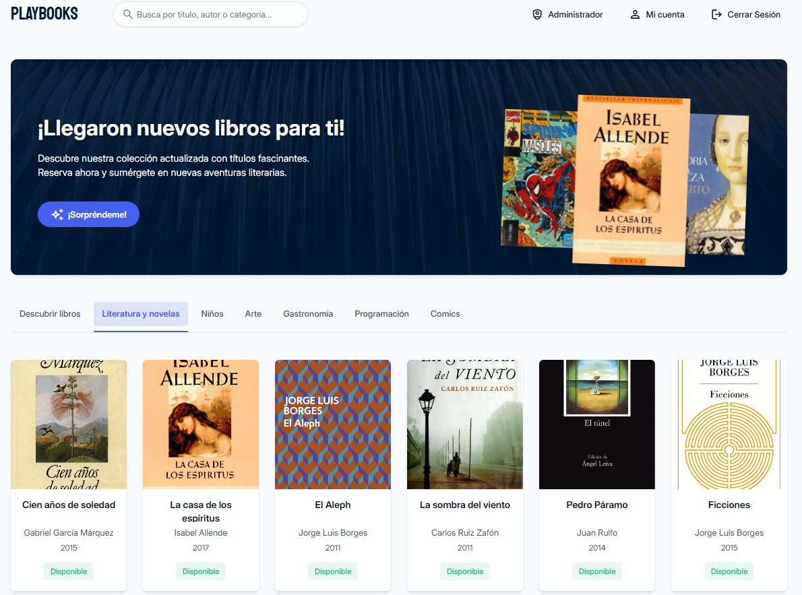
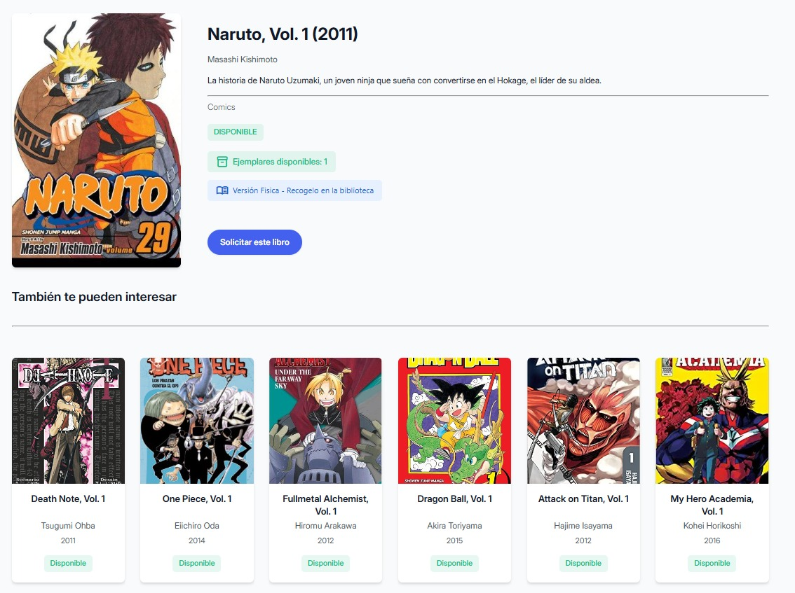
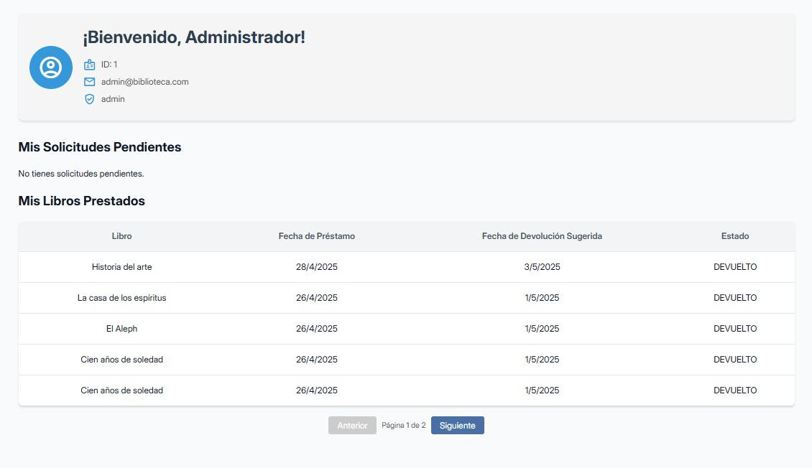
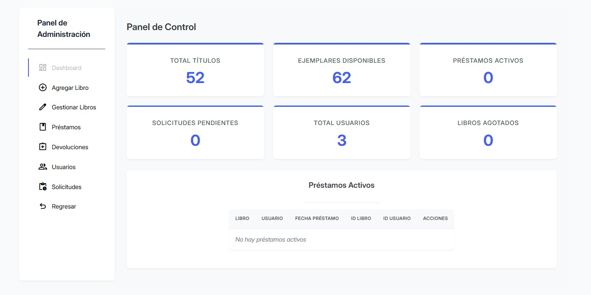

# 📚 PlayBook

> Una moderna aplicación web de gestión de biblioteca que permite a los usuarios explorar, solicitar y disfrutar de una amplia colección de libros.


## ✨ Características Principales

- **Catálogo interactivo** - Exploración de libros por categorías, autor, o título
- **Sistema de búsqueda avanzado** - Encuentra rápidamente cualquier libro en la colección
- **Gestión de préstamos** - Solicitud, seguimiento y devolución de libros
- **Panel de usuario personalizado** - Los usuarios pueden ver sus préstamos y solicitudes pendientes
- **Panel de administración completo** - Gestión de inventario, usuarios y estadísticas
- **Diseño responsivo** - Experiencia óptima en dispositivos móviles y de escritorio

## 🛠️ Tecnologías Utilizadas

- **Frontend:** HTML5, CSS3, JavaScript (Vanilla)
- **Backend:** Flask (Python)
- **Base de datos:** SQLite
- **Iconografía:** Material Design Icons
- **Diseño:** Responsive design con CSS Grid y Flexbox

## 🚀 Instalación

1. **Clona el repositorio**
   ```bash
   git clone https://github.com/tu-usuario/PlayBooks.git
   cd PlayBooks
   ```

2. **Configura un entorno virtual**
   ```bash
   python -m venv venv
   source venv/bin/activate  # En Windows: venv\Scripts\activate
   ```

3. **Instala las dependencias**
   ```bash
   pip install -r requirements.txt
   ```

4. **Inicializa la base de datos**
   ```bash
   flask init-db
   ```

5. **Ejecuta la aplicación**
   ```bash
   flask run
   ```

6. **Abre la aplicación en tu navegador**
   ```
   http://localhost:5000
   ```

## 📖 Uso

### 🧑‍🤝‍🧑 Usuarios Regulares

1. **Explora el catálogo de libros** - Navega por categorías o utiliza el buscador
2. **Regístrate o inicia sesión** - Crea una cuenta para acceder a todas las funcionalidades
3. **Solicita préstamos** - Encuentra un libro y solicítalo para préstamo
4. **Gestiona tu cuenta** - Revisa tus préstamos activos y solicitudes pendientes

### 👨‍💼 Administradores

1. **Gestiona el inventario** - Añade, edita o elimina libros del catálogo
2. **Administra usuarios** - Crea, edita o elimina cuentas de usuario
3. **Gestiona préstamos** - Aprueba solicitudes y registra devoluciones
4. **Consulta estadísticas** - Visualiza métricas importantes sobre el uso de la biblioteca

## 📊 Capturas de Pantalla

| Página Principal | Detalle de Libro | Panel de Usuario | Panel de Administración |
|:---:|:---:|:---:|:---:|
|  |  |  |  |

## 📁 Estructura del Proyecto

```
PlayBook/
│
├── static/               # Recursos estáticos
│   ├── css/              # Hojas de estilo
│   ├── js/               # Scripts de JavaScript
│   ├── images/           # Imágenes del sistema
│   └── covers/           # Portadas de libros
│
├── templates/            # Plantillas HTML
│   ├── index.html        # Página principal
│   ├── libro.html        # Detalle de libro
│   ├── login.html        # Inicio de sesión
│   ├── user.html         # Panel de usuario
│   └── admin.html        # Panel de administración
│
├── app.py                # Aplicación principal Flask
├── models.py             # Modelos de datos
├── routes.py             # Rutas y controladores
├── helpers.py            # Funciones auxiliares
├── config.py             # Configuración de la aplicación
├── requirements.txt      # Dependencias del proyecto
└── README.md             # Este archivo
```

## 👨‍💻 Contribuciones

Las contribuciones son bienvenidas. Para contribuir:

1. Haz un fork del proyecto
2. Crea una rama para tu función (`git checkout -b feature/nueva-funcion`)
3. Realiza tus cambios y haz commit (`git commit -m 'Añadir nueva función'`)
4. Sube los cambios a tu rama (`git push origin feature/nueva-funcion`)
5. Abre un Pull Request

## 📝 Licencia

Este proyecto está licenciado bajo la Licencia MIT - consulta el archivo [LICENSE](LICENSE) para más detalles.

---

Desarrollado con ❤️ 
